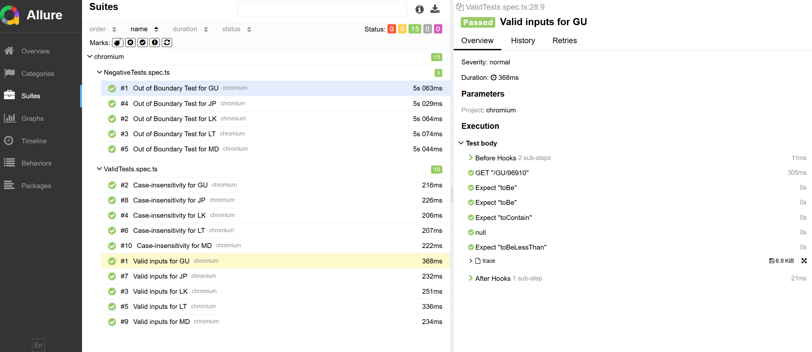
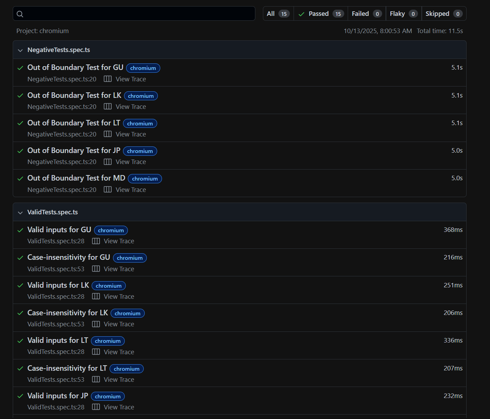

# API Validation Framework for Zippopotam.us (Task 1)

**Objective:** Build a foundational framework to automate testing for the **Zippopotam.us** public API endpoint: `/country/postal-code/`.

---

## Implementation Details

* **Data-Driven Testing (DDT):** Used JSON data to facilitate DDT, incorporating a mix of valid, invalid, and **Boundary Value Analysis (BVA)** test cases for robust negative testing.
* **Schema Validation:** Implemented basic response body schema validation to ensure data integrity and structure, to be datailed once I get API Contract.
* **Server Bug Mitigation:** Addressed a critical server bug where invalid requests resulted in a slow (30s+), incorrect **HTTP 500** (Internal Server Error) response instead of an expected client-side error (e.g., 400/404).
* **Timeout Strategy:** Configured maximum request timeouts to effectively handle the slow, erroneous responses, simulating server instability for invalid test cases.
* **Every invalid Request is Bugged here unfortunately**
---

## Steps

1.  **Install dependencies**:

    ```bash
    npm install
    ```

2.  **Run the tests**:

    ```bash
    npx playwright test
    ```

3.  **View Reports:**

    * **Playwright HTML Report:**

        ```bash
        npx playwright show-report
        ```

    * **Allure Report:**

        ```bash
        allure serve allure-results
        ```

---

## Test Coverage

The test suite includes coverage for the following key scenarios:

* **Positive Testing:** At least one valid country code and postal code combination for each of the 60+ supported countries.
* **Input Validation (Negative Testing):**
    * Non-existent, but validly-formatted postal codes (e.g., `99999`).
    * Postal codes containing special characters (e.g., `12345!@#$`).
    * Empty postal code fields.
* **Edge Cases & Security:**
    * Country code case sensitivity validation (must be valid regardless of case).
    * Basic SQL Injection attempt in the postal code parameter.

---

## Results

Screenshots of the generated reports:

* **Allure Report**
    
* **PlayWright Report**
    

