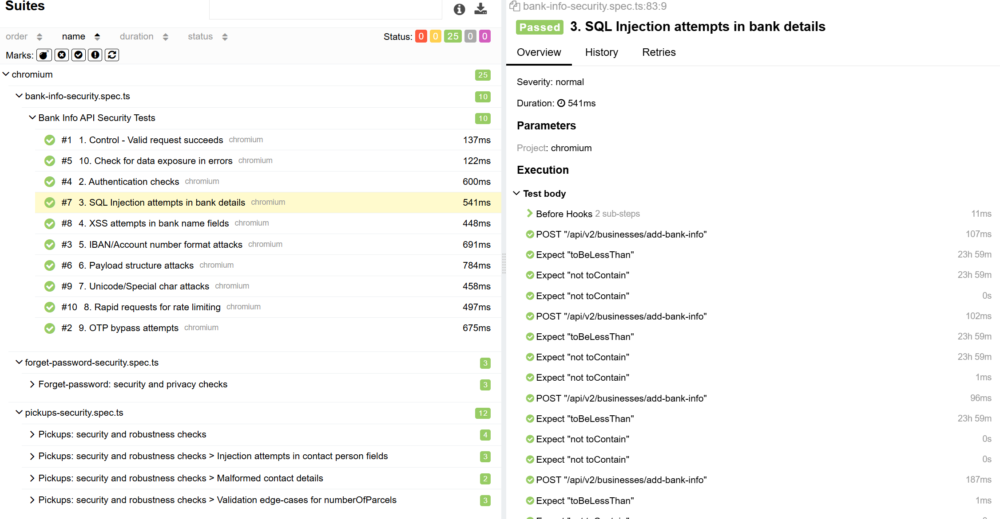
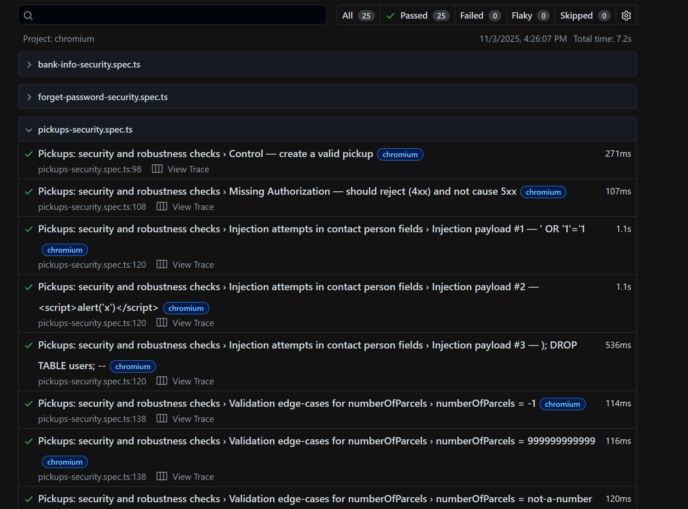

# API Security Automation 

**Objective:**   
Implement comprehensive security testing for API endpoints to identify vulnerabilities and ensure robust protection against common web application threats.

---

## Implementation Details

* **Using copilot + playwright AI agents:**  
    1. made base tests to insure APIs are working and explained what's required to guide Agents, these are necessary or the agents would hullcinate  
    2. asked planner agent to make a test plane and then generator agent to make text cases based on it 
    3. After reviewing few tests We reached an acceptable tests and still some of them still needed fixing so i did it 

* **Authentication & Authorization Testing:** Comprehensive token validation and security checks
 **Input Validation Testing:** SQL injection, XSS, and special character attacks
* **API Security Testing:** Rate limiting, error handling, and data exposure prevention
* **Performance Monitoring:** Server stability and crash detection
* **CI/CD Integration:** added github Actions workflow + "snyk" tool for Automated security testing pipeline with vulnerability scanning and reporting
* **Data-Driven Testing (DDT):** Used payload data to facilitate DDT, incorporating a mix of valid, invalid, and **Boundary Value Analysis (BVA)** test cases for robust negative testing.
---
## Results 
   Screenshots of the generated reports:    
* **Allure Report** 
    
* **PlayWright Report**
   

## Steps
1.  **Install dependencies**:

    ```bash
    npm install
    ```
2.  **Run the tests**:

    ```bash
    npx run security 
    npx run fullSecurity
    ```
3.  **View Reports:**
    * **Playwright HTML Report:**

        ```bash
        npx playwright show-report
        ```
    * **Allure Report:**

        ```bash
        allure serve allure-results
        ```
---

## Test Suite Overview  
**Control Test**  
Verifies basic functionality with valid token and payload  
Logs response for inspection

**Authentication Checks**  
Tests missing token (expects 401)  
Tests invalid token formats  
Tests SQL injection in token  
Ensures no server crashes on bad tokens

**SQL Injection Tests**  
Attempts common SQL injection patterns in bank name fields  
Checks for SQL error leakage  
Monitors for server crashes

**XSS Attempts**  
Tests script injection in name fields  
Checks if response reflects dangerous HTML  
Monitors response sanitization

**IBAN/Account Format Attacks**  
Tests empty values  
Tests buffer overflow with long strings  
Tests path traversal attempts  
Tests template injection

**Payload Structure Attacks**  
Tests missing fields  
Tests null values  
Tests wrong data types  
Tests extra unexpected fields

**Unicode/Special Character Tests**  
Tests null bytes  
Tests RTL override characters  
Tests zero-width spaces  
Tests emoji and special characters

**Rate Limit Testing**  
Sends 10 concurrent requests  
Checks if rate limiting is implemented  
Monitors for server stability

**OTP Bypass Attempts**  
Tests common default values  
Tests sequential numbers  
Tests template injection  
Tests buffer overflow

**Error Information Exposure**  
Triggers validation errors
Checks for sensitive data in errors
Monitors for stack traces  

---
## Quality Assurance Metrics
* 25 comprehensive test cases covering security vulnerabilities

* 100% test execution rate with detailed reporting

* Multi-layered security validation from authentication to input sanitization

* Proactive crash detection and stability monitoring

## Features:  
* Auto-generates fresh token before tests  
* Reuses token across tests for efficiency  
* Helper function for consistent request handling  
* Detailed logging of responses  
* Checks for server stability (no 500s)  
* Monitors for sensitive data exposure

By Eng\ Khaled MohyEldin


